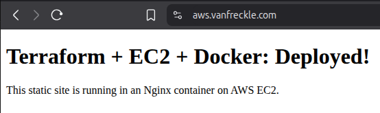

# AWS DevOps Capstone Project


[](https://github.com/jasonvandeventer/terraform_capstone)
[](https://aws.vanfreckle.com)

**Terraform-powered infrastructure with automated CI/CD and containerized deployment**

## Overview

This project demonstrates my ability to provision secure, scalable AWS infrastructure using Terraform, automate deployments with GitHub Actions, and containerize applications with Docker.

## ✅ Live Demo

🌐 **Production Deployment**: [`https://aws.vanfreckle.com`](https://aws.vanfreckle.com)



The deployed site serves a static HTML app from an Nginx container on EC2, behind an Application Load Balancer with TLS enabled.

## 🚀 Quickstart

Provision a working AWS environment in minutes:

```bash
terraform init && terraform apply
```

## Project Goals

* Provision reusable AWS infrastructure using modular Terraform *(Domain 3: Design Resilient Architectures)*
* Automate provisioning and deployment via GitHub Actions *(Domain 4: Cost-Optimized and Automated Solutions)*
* Deploy a secure, containerized static web app on EC2 with Nginx *(Domain 2: Design Secure Architectures)*
* Integrate remote S3 state backend to enable collaboration and version control *(Domain 3: Resilient & Auditable)*
* Prepare for horizontal scalability and SSL/TLS encryption with ALB + ACM *(Domain 1: High Availability, Secure Networking)*
* Add EC2 Auto Scaling Group across two AZs *(Domain 1 & 3)*

## Tech Stack

* **Infrastructure**: AWS (VPC, EC2, S3, Security Groups, ALB, RDS, DynamoDB)
* **IaC**: Terraform
* **CI/CD**: GitHub Actions
* **App**: Static site on Nginx (Dockerized)
* **Language**: HCL (Terraform), Bash

## Key Terraform Files

* [`infra/alb.tf`](infra/alb.tf) – Application Load Balancer
* [`infra/auto_scaling.tf`](infra/auto_scaling.tf) – Launch Template + Auto Scaling Group for EC2
* [`infra/iam.tf`](infra/iam.tf) – IAM roles for EC2 to S3 access
* [`infra/s3.tf`](infra/s3.tf) – S3 integration and future expansion
* [`infra/vpc.tf`](infra/vpc.tf) – VPC, subnets, route tables

## Auto Scaling Group (ASG) + Launch Template – High Availability *(Domain 1 & 3)*

To achieve horizontal scalability and fault tolerance, the application is deployed using an **Auto Scaling Group (ASG)** tied to a **Launch Template**.

### 🧩 Core Features

- **Launch Template** provisions Amazon Linux 2023 with Docker and Nginx via `user_data`
- ASG spans **two public subnets in separate Availability Zones**
- Integrates with the ALB via a **Target Group** and **ELB health checks**
- **Self-healing**: unhealthy EC2 instances are automatically terminated and replaced
- **Elasticity**: supports min/max/desired capacity configuration via Terraform
- **Versioning**: Launch Template updates support rolling deploys

* Launch Template with Amazon Linux 2 and Nginx installed via `user_data`
* ASG automatically launches EC2 instances across multiple Availability Zones
* Health Checks via ALB target group ensure only healthy instances receive traffic
* Scalability: `desired_capacity` set to 2 to demonstrate horizontal scale

### 📸 Screenshots

| ALB Working in Browser           | ASG Instance Health                  | Target Group Status                      |
| -------------------------------- | ------------------------------------ | ---------------------------------------- |
|  |  |  |

## ✅ Application Response Validation

```bash
$ curl localhost
<html>
  <head>
    <title>Capstone Deployed</title>
  </head>
  <body>
    <h1>Terraform + EC2 + Docker: Deployed!</h1>
    <p>This static site is running in an Nginx container on AWS EC2.</p>
  </body>
</html>
```

## 🗺️ Architecture

```mermaid
graph TD
  subgraph VPC [VPC]
    igw[Internet Gateway]
    alb[Application Load Balancer]
    subnet1[Public Subnet AZ1]
    subnet2[Public Subnet AZ2]
    asg[Auto Scaling Group]
    ec2a[EC2 Instance AZ1]
    ec2b[EC2 Instance AZ2]
    rds["RDS (PostgreSQL)"]
    dynamodb["DynamoDB Table"]
    alb -->|"HTTPS (443)"| ec2a
    alb -->|"HTTPS (443)"| ec2b
    ec2a -->|"Docker Nginx"| app1[Static App]
    ec2b -->|"Docker Nginx"| app2[Static App]
    ec2a --> rds
    ec2b --> dynamodb
    subnet1 --> alb
    subnet2 --> alb
    subnet1 --> ec2a
    subnet2 --> ec2b
  end

  github[GitHub Actions CI/CD] -->|Terraform Deploy| alb
  github -->|Terraform Deploy| rds
  github -->|Terraform Deploy| asg

  s3[S3 Backend] -->|Remote State| github
  ddb[DynamoDB Lock Table] -->|State Locking| github

  acm[ACM Certificate] --> alb
  iam[IAM Role] --> ec2a
  iam --> ec2b
  ec2a --> s3
  ec2b --> s3
  ```
## 🛠️ Database Layer

### RDS (PostgreSQL)

* Managed PostgreSQL 15.3 in private subnets
* Connected to EC2 app tier
* Output: `${terraform output rds_endpoint}`

### DynamoDB

* Serverless, PAY\_PER\_REQUEST billing
* Primary key: `user_id`
* Output: `${terraform output dynamodb_table_name}`

## IAM Role Configuration (EC2 + S3 Integration)

* **Role**: `EC2S3AccessRole` attached via launch template
* **Policy**: `AmazonS3FullAccess` (demo only)
* **IMDSv2**: Enabled for security compliance

### IAM Validation Example

```bash
TOKEN=$(curl -X PUT "http://169.254.169.254/latest/api/token" \
  -H "X-aws-ec2-metadata-token-ttl-seconds: 21600")
curl -H "X-aws-ec2-metadata-token: $TOKEN" \
  http://169.254.169.254/latest/meta-data/iam/info
```

## CI/CD Pipeline

1. Terraform fmt & validate
2. Docker image build & scan
3. Deploy app to EC2

## Dockerized Application

* Multi-stage Dockerfile for Nginx static site
* Image hosted on Docker Hub, scanned with Trivy

## AWS S3 Integration Plan

* Private bucket `myproject-prod-assets`
* Versioning enabled
* Lifecycle rule to Glacier after 30 days

## Key Features

* ✅ **IaC** via Terraform *(Domain 3)*
* ✅ **CI/CD** with GitHub Actions *(Domain 4)*
* ✅ **Auto Scaling** across AZs *(Domain 1 & 3)*
* ✅ **HTTPS with ACM + ALB** *(Domain 2)*
* ✅ **Dockerized EC2** behind ALB *(Domain 2)*
* ✅ **Credential-Free IAM Role Access to S3** *(Domain 2)*
* ✅ **RDS and DynamoDB provisioning** *(Domain 3)*

## 🔮 Future Enhancements

* Add Route 53 + CloudFront
* Centralized logging via CloudWatch
* ALB + ECS migration (Fargate)
* Secrets Manager integration

## Deployment Milestones

* ✅ HTTPS with ACM + Cloudflare
* ✅ ALB with 301 redirect
* ✅ Auto Scaling Group
* ✅ RDS PostgreSQL and DynamoDB

## Terraform Outputs

* ALB DNS
* EC2 Public IP
* RDS Endpoint
* DynamoDB Table
* VPC ID & Subnet ID

## Usage

```bash
git clone https://github.com/jasonvandeventer/terraform_capstone.git
cd terraform_capstone

terraform init
terraform plan
terraform apply
```

## License

MIT License. See [LICENSE](./LICENSE)

## Author

Jason VanDeventer – [vanfreckle.com](https://vanfreckle.com)

---

**What I Learned**

* Modular IaC with Terraform
* IAM and S3 access without credentials
* Auto Scaling, ALB, and RDS best practices
* IMDSv2 metadata and launch template intricacies
* Debugging real AWS deployment failures
* Production documentation standards for hiring visibility
