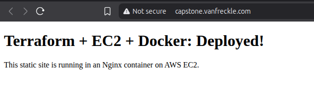
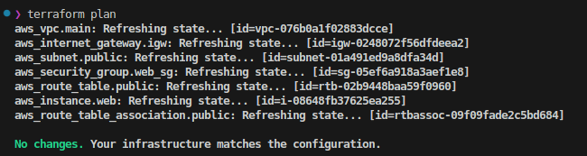

# AWS DevOps Capstone Project


**Terraform-powered infrastructure with automated CI/CD and containerized deployment**

## Overview

This project demonstrates my ability to provision secure, scalable AWS infrastructure using Terraform, automate deployments with GitHub Actions, and containerize applications with Docker.

## Project Goals

- Provision reusable AWS infrastructure using modular Terraform
- Automate provisioning and deployment via GitHub Actions
- Deploy a secure, containerized static web app on EC2 with Nginx
- Integrate remote S3 state backend to enable collaboration and version control
- Prepare for horizontal scalability and SSL/TLS encryption with ALB + ACM


## Tech Stack

- **Infrastructure**: AWS (VPC, EC2, S3, Security Groups)
- **IaC**: Terraform
- **CI/CD**: GitHub Actions
- **App**: Static site on Nginx (Dockerized)
- **Language**: HCL (Terraform), Bash

## Architecture

```mermaid
graph TB
    subgraph "GitHub"
        GHA[GitHub Actions<br/>CI/CD Pipeline]
    end

    subgraph "AWS Cloud (us-east-2)"
        subgraph "State Storage"
            S3_BUCKET[S3 Bucket<br/>jv-devops-capstone-tfstate<br/>Terraform Remote State]
        end

        subgraph "VPC: capstone-vpc (10.0.0.0/16)"
            IGW[Internet Gateway<br/>capstone-igw]

            subgraph "Public Subnet: 10.0.1.0/24 (us-east-2a)"
                RT[Route Table<br/>capstone-public-rt<br/>0.0.0.0/0 → IGW]
                SG[Security Group: web-sg<br/>Ingress: 22, 80/tcp<br/>Source: 0.0.0.0/0]

                subgraph "EC2 Instance: capstone-web"
                    EC2[t2.micro<br/>Amazon Linux 2023<br/>Public IP assigned]
                    subgraph "Docker"
                        NGINX[Nginx Container<br/>Port 80:80<br/>Static HTML Site]
                    end
                end
            end
        end
    end

    subgraph "External"
        USERS[Internet Users<br/>HTTP/SSH Access]
        DOCKER_HUB[Docker Hub<br/>coruscantsunrise/capstone-nginx:latest<br/>Trivy Scanned]
    end

    %% Connections
    USERS -->|HTTP:80/SSH:22| IGW
    IGW --> RT
    RT --> SG
    SG --> EC2
    EC2 --> NGINX

    %% CI/CD Flow
    GHA -.->|terraform apply| S3_BUCKET
    GHA -.->|deploy & monitor| EC2

    %% Container Flow
    DOCKER_HUB -->|docker pull| NGINX

    %% Styling
    classDef aws fill:#FF9900,stroke:#232F3E,stroke-width:2px,color:#fff
    classDef vpc fill:#4CAF50,stroke:#2E7D32,stroke-width:2px,color:#fff
    classDef subnet fill:#2196F3,stroke:#1565C0,stroke-width:2px,color:#fff
    classDef security fill:#FF5722,stroke:#D84315,stroke-width:2px,color:#fff
    classDef compute fill:#FF9900,stroke:#F57C00,stroke-width:3px,color:#fff
    classDef container fill:#0db7ed,stroke:#0099cc,stroke-width:2px,color:#fff
    classDef external fill:#607D8B,stroke:#455A64,stroke-width:2px,color:#fff
    classDef cicd fill:#24292e,stroke:#1B1F23,stroke-width:2px,color:#fff

    class S3_BUCKET,IGW aws
    class RT,SG security
    class EC2 compute
    class NGINX container
    class USERS,DOCKER_HUB external
    class GHA cicd
    ```


### CIDR Strategy

- **VPC:** `10.0.0.0/16` – allows for up to 65,536 private IPs
- **Public Subnet:** `10.0.1.0/24` – 256 addresses for internet-facing resources
- **Private Subnet (planned):** `10.0.2.0/24` – reserved for NAT/ALB targets or databases

## Screenshots

### Live Site


### Terraform Plan


### EC2 Running Container


### Infrastructure Components

#### Core AWS Resources
- **VPC**: Custom network (10.0.0.0/16) with DNS support enabled
- **Public Subnet**: Single subnet (10.0.1.0/24) in availability zone us-east-2a
- **Internet Gateway**: Provides internet access for public resources
- **Route Table**: Routes all traffic (0.0.0.0/0) through the Internet Gateway
- **Security Group**: Allows inbound SSH (port 22) and HTTP (port 80) from anywhere

#### Compute & Application
- **EC2 Instance**: t2.micro running Amazon Linux 2023 with auto-assigned public IP
- **Docker Container**: Nginx serving static HTML site on port 80
- **Container Image**: Multi-stage Docker build, Trivy scanned for vulnerabilities

#### DevOps Pipeline
- **Terraform State**: Stored securely in S3 bucket for team collaboration
- **GitHub Actions**: Automated CI/CD pipeline for validation, build, and deployment
- **Infrastructure as Code**: All resources defined and managed through Terraform

### Data Flow

1. **User Request**: Internet users access the application via HTTP/SSH
2. **Network Routing**: Traffic flows through Internet Gateway → Route Table → Security Group
3. **Application Serving**: EC2 instance serves content via Docker container
4. **Container Management**: Docker pulls latest images from Docker Hub registry
5. **Infrastructure Management**: Terraform manages all AWS resources with state in S3

## CI/CD Pipeline

1. Terraform fmt & validate
2. Docker image build & scan
3. Deploy app to EC2

## Dockerized Application

Multi-stage Dockerfile for a static Nginx site, scanned with Trivy for security vulnerabilities. Container image hosted on Docker Hub with automated builds and security scanning integrated into the CI/CD pipeline.

## AWS S3 Integration Plan

- **Use Case:** Store user-uploaded images and backups.
- **Buckets:** Single bucket in us-east-2 named: `myproject-prod-assets`.
- **Access Control:** Private bucket with IAM roles permitting EC2 instance access.
- **Versioning:** Enabled for data recovery.
- **Lifecycle Management:** Transition backups to Glacier after 30 days.
- **Replication:** Not required at this stage (revisit as project scales).

## IAM Role Configuration (EC2 + S3 Integration)

- Created an IAM role (`EC2S3AccessRole`) with attached policy (`AmazonS3ReadOnlyAccess`) to grant secure S3 access.
- Launched EC2 instances with this IAM role to securely access S3 without explicitly storing credentials.
- Tested and verified successful access via AWS CLI (`aws s3 ls`, `aws s3 cp`) directly from EC2 instances.

**Observations:**
- Instances with IAM roles securely interact with S3, removing the need for credential management.
- Verified best practice adherence for AWS security.

## Coming Next: ALB + ACM Integration

- [ ] Add Application Load Balancer to serve the Nginx app.
- [ ] Configure Target Group with EC2 instances.
- [ ] Provision SSL certificate via ACM.
- [ ] Redirect HTTP to HTTPS on ALB listener.
- [ ] Update Security Groups accordingly.
- [ ] Output ALB DNS name for public access.

## Key Features

- ✅ **Infrastructure as Code**: Complete infrastructure defined in Terraform
- ✅ **Automated CI/CD**: GitHub Actions pipeline for testing and deployment  
- ✅ **Container Security**: Trivy scanning for vulnerability detection
- ✅ **Remote State Management**: Terraform state stored in S3 for collaboration
- ✅ **Scalable Architecture**: Designed for easy horizontal scaling
- ✅ **Security Best Practices**: Security groups and IAM roles properly configured

## Usage

```bash
git clone https://github.com/jasonvandeventer/terraform_capstone.git
cd terraform_capstone

# Initialize Terraform
terraform init

# Plan the deployment
terraform plan

# Apply the configuration
terraform apply
```

Infrastructure will be provisioned in AWS us-east-2 region with all components automatically configured and connected.

## Terraform Outputs

- **EC2 Public IP**: Direct access to the deployed application
- **VPC ID**: Reference for additional resource deployment
- **Subnet ID**: Network configuration details

## Live Demo

👉 [http://3.15.25.142](http://3.15.25.142)
> 🔁 **Note**: IP address may change on instance restart. Use output or ALB DNS name once available.

## Author

Jason VanDeventer – [vanfreckle.com](https://vanfreckle.com)

## License

All screenshots and diagrams are original unless otherwise noted.

This project is licensed under the MIT License. See [LICENSE](./LICENSE) for details.


**Portfolio Progression**: This capstone project integrates and builds upon the individual DevOps skills demonstrated across my portfolio, culminating in a production-ready infrastructure deployment that showcases expertise in cloud architecture, automation, and security best practices.