# AWS DevOps Capstone Project


**Terraform-powered infrastructure with automated CI/CD and containerized deployment**

## Overview

This project demonstrates my ability to provision secure, scalable AWS infrastructure using Terraform, automate deployments with GitHub Actions, and containerize applications with Docker.

## 🚀 Quickstart

Provision a working AWS environment in minutes:

```bash
terraform init && terraform apply
```

## Project Goals

- Provision reusable AWS infrastructure using modular Terraform *(Domain 3: Design Resilient Architectures)*
- Automate provisioning and deployment via GitHub Actions *(Domain 4: Cost-Optimized and Automated Solutions)*
- Deploy a secure, containerized static web app on EC2 with Nginx *(Domain 2: Design Secure Architectures)*
- Integrate remote S3 state backend to enable collaboration and version control *(Domain 3: Resilient & Auditable)*
- Prepare for horizontal scalability and SSL/TLS encryption with ALB + ACM *(Domain 1: High Availability, Secure Networking)*
- Add EC2 Auto Scaling Group across two AZs *(Domain 1 & 3)*


## Tech Stack

- **Infrastructure**: AWS (VPC, EC2, S3, Security Groups, ALB)
- **IaC**: Terraform
- **CI/CD**: GitHub Actions
- **App**: Static site on Nginx (Dockerized)
- **Language**: HCL (Terraform), Bash

## Key Terraform Files

- [`infra/vpc.tf`](infra/vpc.tf) – VPC, subnets, route tables
- [`infra/alb.tf`](infra/alb.tf) – Application Load Balancer
- [`infra/ec2.tf`](infra/ec2.tf) – EC2 instance and Docker bootstrap
- [`infra/iam.tf`](infra/iam.tf) – IAM roles for EC2 to S3 access
- [`infra/s3.tf`](infra/s3.tf) – S3 integration and future expansion

## Auto Scaling Group (ASG) – Resilience & High Availability *(Domain 3)*

To demonstrate high availability and resilience, this project includes a fully Terraform-managed EC2 Auto Scaling Group (ASG) integrated with an Application Load Balancer (ALB).

### ✅ Features Implemented

- Launch Template with Amazon Linux 2 and Nginx installed via `user_data`
- ASG automatically launches EC2 instances across multiple Availability Zones
- Health Checks via ALB target group ensure only healthy instances receive traffic
- Scalability: `desired_capacity` set to 2 to demonstrate horizontal scale

### 📸 Screenshots

| ALB Working in Browser | ASG Instance Health | Target Group Status |
|------------------------|---------------------|----------------------|
|  |  |  |


## Architecture

```mermaid
graph TB
    subgraph "GitHub"
        GHA[GitHub Actions<br/>CI/CD Pipeline]
    end

    subgraph "AWS Cloud (us-east-2)"
        subgraph "State Storage"
            S3_BUCKET[S3 Bucket<br/>jv-devops-capstone-tfstate<br/>Terraform Remote State]
        end

        subgraph "VPC: capstone-vpc (10.0.0.0/16)"
            IGW[Internet Gateway<br/>capstone-igw]

            subgraph "Public Subnet: 10.0.1.0/24 (us-east-2a)"
                RT[Route Table<br/>capstone-public-rt<br/>0.0.0.0/0 → IGW]
                SG[Security Group: web-sg<br/>Ingress: 22, 80/tcp<br/>Source: 0.0.0.0/0]

                subgraph "EC2 Instance: capstone-web"
                    EC2[t2.micro<br/>Amazon Linux 2023<br/>Public IP assigned]
                    subgraph "Docker"
                        NGINX[Nginx Container<br/>Port 80:80<br/>Static HTML Site]
                    end
                end
            end
        end

        subgraph "Public Subnet: 10.0.2.0/24 (us-east-2b)"
                ALB[Application Load Balancer<br/>capstone-alb<br/>DNS Routed to EC2]
            end

            ALB -->|Forward to port 80| EC2
            USERS -->|HTTP:80| ALB
    end

    subgraph "External"
        USERS[Internet Users<br/>HTTP/SSH Access]
        DOCKER_HUB[Docker Hub<br/>coruscantsunrise/capstone-nginx:latest<br/>Trivy Scanned]
    end

    %% Connections
    USERS -->|HTTP:80/SSH:22| IGW
    IGW --> RT
    RT --> SG
    SG --> EC2
    EC2 --> NGINX

    %% CI/CD Flow
    GHA -.->|terraform apply| S3_BUCKET
    GHA -.->|deploy & monitor| EC2

    %% Container Flow
    DOCKER_HUB -->|docker pull| NGINX

    %% Styling
    classDef aws fill:#FF9900,stroke:#232F3E,stroke-width:2px,color:#fff
    classDef vpc fill:#4CAF50,stroke:#2E7D32,stroke-width:2px,color:#fff
    classDef subnet fill:#2196F3,stroke:#1565C0,stroke-width:2px,color:#fff
    classDef security fill:#FF5722,stroke:#D84315,stroke-width:2px,color:#fff
    classDef compute fill:#FF9900,stroke:#F57C00,stroke-width:3px,color:#fff
    classDef container fill:#0db7ed,stroke:#0099cc,stroke-width:2px,color:#fff
    classDef external fill:#607D8B,stroke:#455A64,stroke-width:2px,color:#fff
    classDef cicd fill:#24292e,stroke:#1B1F23,stroke-width:2px,color:#fff
    classDef loadbalancer fill:#673AB7,stroke:#4527A0,stroke-width:2px,color:#fff

    class S3_BUCKET,IGW aws
    class RT,SG security
    class EC2 compute
    class NGINX container
    class USERS,DOCKER_HUB external
    class GHA cicd
    class ALB loadbalancer
```



### CIDR Strategy

- **VPC:** `10.0.0.0/16` – allows for up to 65,536 private IPs
- **Public Subnet:** `10.0.1.0/24` – 256 addresses for EC2, Nginx
- **Public Subnet 2:** `10.0.2.0/24` – second AZ for ALB high availability 
- **Private Subnet (planned):** `10.0.3.0/24` – reserved for NAT/ALB targets or databases

## Screenshots

### Live Site


### Terraform Plan


### EC2 Running Container


### Infrastructure Components

#### Load Balancer
- **Application Load Balancer (ALB)**: Internet-facing ALB that distributes HTTP traffic to EC2 instances.
- **Listener**: Accepts HTTP traffic on port 80 and forwards to the target group.
- **Target Group**: Points to the EC2 instance on port 80 with health checks on `/`.
- ***Availability Zones**: Deployed across `us-east-2a` and `us-east-2b` for HA.

#### Core AWS Resources
- **VPC**: Custom network (10.0.0.0/16) with DNS support enabled
- **Subnets**: Two public subnets in separate AZs
- **Internet Gateway**: Provides internet access for public resources
- **Route Table**: Routes all traffic (0.0.0.0/0) through the Internet Gateway
- **Security Group**: Allows inbound SSH (port 22) and HTTP (port 80) from anywhere

#### Compute & Application
- **EC2 Instance**: t2.micro running Amazon Linux 2023 with auto-assigned public IP
- **Docker Container**: Nginx serving static HTML site on port 80
- **Container Image**: Multi-stage Docker build, Trivy scanned for vulnerabilities

#### DevOps Pipeline
- **Terraform State**: Stored securely in S3 bucket for team collaboration
- **GitHub Actions**: Automated CI/CD pipeline for validation, build, and deployment
- **Infrastructure as Code**: All resources defined and managed through Terraform

### Data Flow

1. **User Request**: Internet users access the application via HTTP/SSH
2. **Network Routing**: Traffic flows through Internet Gateway → Route Table → Security Group
3. **Application Serving**: EC2 instance serves content via Docker container
4. **Container Management**: Docker pulls latest images from Docker Hub registry
5. **Infrastructure Management**: Terraform manages all AWS resources with state in S3

## CI/CD Pipeline

1. Terraform fmt & validate
2. Docker image build & scan
3. Deploy app to EC2

## Dockerized Application

Multi-stage Dockerfile for a static Nginx site, scanned with Trivy for security vulnerabilities. Container image hosted on Docker Hub with automated builds and security scanning integrated into the CI/CD pipeline.

## AWS S3 Integration Plan

- **Use Case:** Store user-uploaded images and backups.
- **Buckets:** Single bucket in us-east-2 named: `myproject-prod-assets`.
- **Access Control:** Private bucket with IAM roles permitting EC2 instance access.
- **Versioning:** Enabled for data recovery.
- **Lifecycle Management:** Transition backups to Glacier after 30 days.
- **Replication:** Not required at this stage (revisit as project scales).

## IAM Role Configuration (EC2 + S3 Integration)

- Created an IAM role (`EC2S3AccessRole`) with attached policy (`AmazonS3ReadOnlyAccess`) to grant secure S3 access.
- Launched EC2 instances with this IAM role to securely access S3 without explicitly storing credentials.
- Tested and verified successful access via AWS CLI (`aws s3 ls`, `aws s3 cp`) directly from EC2 instances.

**Observations:**
- Instances with IAM roles securely interact with S3, removing the need for credential management.
- Verified best practice adherence for AWS security.

## 🔮 Future Enhancements

- Add Route 53 and CloudFront for CDN + global DNS *(Domain 1 & 3)*
- ✅ Auto Scaling Group + Launch Templates *(Complete)*
- RDS integration with private access *(Domain 1 & 3)*
- Centralized logging via CloudWatch *(Domain 2 & 4)*

## Key Features

- ✅ **Infrastructure as Code**: Complete infrastructure defined in Terraform *(Domain 3)*
- ✅ **Automated CI/CD**: GitHub Actions pipeline for testing and deployment *(Domain 4)*
- ✅ **Container Security**: Trivy scanning for vulnerability detection *(Domain 2)*
- ✅ **Remote State Management**: Terraform state stored in S3 for collaboration *(Domain 3)*
- ✅ **Scalable Architecture**: Auto Scaling Group spans multiple AZs *(Domain 1 & 3)*
- ✅ **Security Best Practices**: IAM roles, SGs, ALB health checks all enforced *(Domain 2)*


### Deployment Milestones

- ✅ HTTPS with ACM + Cloudflare (wildcard cert)
- ✅ ALB with 301 redirect from HTTP to HTTPS
- ✅ Dockerized EC2 in private subnet, secured behind ALB

## Usage

```bash
git clone https://github.com/jasonvandeventer/terraform_capstone.git
cd terraform_capstone

# Initialize Terraform
terraform init

# Plan the deployment
terraform plan

# Apply the configuration
terraform apply
```

Infrastructure will be provisioned in AWS us-east-2 region with all components automatically configured and connected.

## Terraform Outputs

- **ALB DNS Name**: Public DNS endpoint for the application
- **EC2 Public IP**: Direct access to the deployed application
- **VPC ID**: Reference for additional resource deployment
- **Subnet ID**: Network configuration details

## Live Demo

👉 [Capstone Through ALB](http://capstone-alb-31519764.us-east-2.elb.amazonaws.com)
> 🔁 **Note**: This is served through the Application Load Balancer, not directly via EC2.

## Author

Jason VanDeventer – [vanfreckle.com](https://vanfreckle.com)

## License

All screenshots and diagrams are original unless otherwise noted.

This project is licensed under the MIT License. See [LICENSE](./LICENSE) for details.

**Portfolio Progression**: This capstone project integrates and builds upon the individual DevOps skills demonstrated across my portfolio, culminating in a production-ready infrastructure deployment that showcases expertise in cloud architecture, automation, and security best practices.

## 🧠 What I Learned

- How to design and deploy fault-tolerant, multi-AZ AWS infrastructure using Terraform  
- How to resolve real-world deployment issues (e.g., subnet CIDR conflicts, ALB AZ constraints, ENI lockups)  
- Best practices for IAM roles and securely accessing S3 without exposing credentials  
- How to automate infrastructure provisioning and Docker deployments using GitHub Actions  
- How to structure and document a production-ready infrastructure-as-code project for hiring visibility  
- The importance of planning CIDR strategies, availability zones, and security groups up front  
- How to build a modular Terraform codebase that supports future expansion (ACM, ASG, RDS, Route 53)